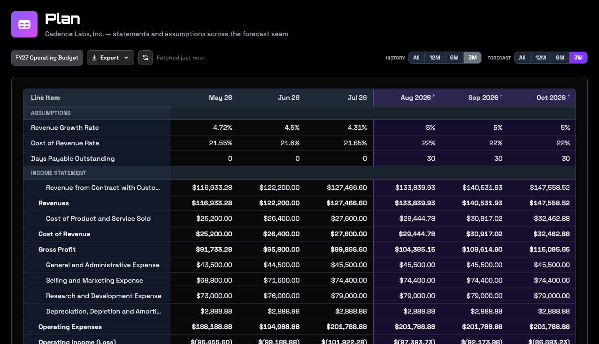

A forecast in RoboLedger is a scenario: a named set of assumptions that your AI assistant projects forward from your last closed month, one month at a time, for up to 36 months. You describe the assumptions in a conversation. RoboLedger calculates the income statement, balance sheet and cash flow for every month, and checks each one the same way it checks your actual books.

Forecasts are calculated, not generated. The same assumptions always give the same numbers, and running a forecast uses no credits. Nothing about planning writes to QuickBooks.

## What you need first

A scenario starts from closed months, because that's where its opening balances come from.

- **At least one closed month.** If you've closed months in RoboLedger, you're set.
- **Or your history filled in.** If your books came over from QuickBooks with years of history but you haven't closed month by month in RoboLedger, ask your assistant to fill in the plan history. It works through past months oldest first, up to 24 months in a run, saves each month's statements, and tells you what's left so you can run it again. It never posts an entry, never reaches back past your earliest transaction, skips any month that still has draft entries, and leaves the month you're working on alone.
- **A mapped chart of accounts.** The forecast is built on your statements, and statements need mapping. See [Map your chart of accounts](map-your-chart-of-accounts.md).

Ask: "Fill in our plan history for the last two years, then tell me which months it covered."

## Build a scenario

Tell your assistant what you want to plan for. It turns that into a scenario with a name, a kind (budget, forecast or projection, which is a label for you and doesn't change the math), a length in months, and assumptions.

There are three kinds of assumption, and a scenario can mix them.

### Drivers

Four drivers move several lines at once, the way they do in a real business:

| Driver | What it does |
|---|---|
| Revenue growth | Revenue grows by a percentage each month, compounding on the month before. |
| Cost of revenue rate | Cost of revenue is a percentage of the same month's revenue. |
| Days sales outstanding | Accounts receivable follows revenue and how many days customers take to pay. |
| Days payable outstanding | Accounts payable follows cost of revenue and how many days you take to pay. |

Each driver takes one value for the whole scenario, or a value for specific months. A driver only acts in the months you gave it a value for.

### A number you set yourself

Any line on your statements can be set directly for the months you name: rent at 4,200 from January, a one-time legal bill in March, a loan balance you know in advance. A number you set wins over everything else for those months.

You can set detail lines, not subtotals. Gross profit, operating income, net income, total assets and the rest are always calculated from the lines beneath them. So a number you typed still flows up through the statement, into retained earnings, cash and the cash flow statement, and the month still has to balance.

### Growth on one line

Any income statement line can grow or shrink by a percentage each month, compounding: payroll up 3% a month from October, software spend down 5% a month. Give one rate, or rates for specific months. A month without a rate holds the line where it was.

Each line has one owner. A line can't be set by you and also grown, or grown while a driver is already moving it. Your assistant tells you which one is in the way.

### Everything else

Lines you say nothing about carry forward from the last actual month. [Schedules](schedules.md) keep running, so depreciation, amortization and prepaid expenses continue at their scheduled amounts and stop when the schedule ends.

Carrying forward is a good default and a bad answer for a one-off. If last month had an unusual gain or a big annual payment, ask your assistant to set that line to zero, or to its normal amount, so it isn't repeated every month.

## What RoboLedger calculates

For every month of the scenario, in order:

1. The income statement, from your drivers, your numbers, growth rates, schedules and carried lines, down to net income.
2. The balance sheet. Receivables and payables follow their drivers, schedules move the assets they belong to, net income rolls into retained earnings, and cash is whatever makes the balance sheet balance.
3. The cash flow statement, from the changes in the balance sheet, so it ties to the change in cash.

Then the month is checked with the same rules that check your actual statements: subtotals add up, assets equal liabilities plus equity, the cash flow ties to the balance sheet. If a month fails, the run stops there. Your assistant tells you which month and which check, and nothing after it is calculated from a month that was wrong.

## See it on the Plan page

Open **Plan** in RoboLedger. It shows your statements and the scenario's assumptions in one monthly grid, with actual months on the left and forecast months on the right. Forecast months are marked with an F.

The assumptions rows run across the actual months too. There they show what each rate really was, so you can see at a glance whether 5% monthly growth is a stretch or a slowdown.

- **Scenario** picks which scenario you're looking at. **Actuals** shows history on its own.
- **History** and **Forecast** set how many months show on each side.
- The address of the page includes the scenario, so you can copy it to share that view with someone who has access to your graph.
- Export the grid as CSV or JSON.

Scenarios are built and changed through your AI assistant. The Plan page is where you read them.

## Change it, and run it again

Ask your assistant to change an assumption, and it updates the scenario and runs it again. Running a scenario again replaces its old numbers.

After you close a month, run your scenarios again. The line between actual and forecast moves forward on its own: the month you just closed becomes an actual, and the scenario picks up from its real closing balances. Your assumptions stay as you wrote them. A scenario whose last month is now in the past has nothing left to calculate. Ask your assistant to make it longer.

Most scenarios should follow your closes like this. If you want a what-if that stays pinned to an earlier month, such as "what if we had raised prices last January", ask your assistant to fix the scenario to that month.

Deleting a scenario removes its assumptions and its forecast numbers. Your actual books are never touched by a scenario, and forecast numbers never appear in your statements or reports.

## What it doesn't do

- Forecasts are monthly. There are no weekly or daily forecasts.
- There are four drivers. Anything else is a number you set or a growth rate on a line, so "payroll is 20% of revenue" is something your assistant works out and sets month by month, not a rule the scenario keeps.
- Seasonality is entered as values for specific months. There is no seasonal formula.
- Owner distributions and dividends aren't modeled. Retained earnings grows by net income.

## Try asking

- "Build a twelve month budget from our last closed month. Revenue grows 2% a month and customers pay in 40 days."
- "Add a scenario where we hire two engineers in October at 12,000 a month each."
- "Last month had a one-time insurance payout. Set that line to zero in every scenario."
- "How many months of cash do we have in the downside scenario?"
- "We closed September. Run all our scenarios again and tell me what changed."

## Go deeper

- [Forecasting and metrics](https://robosystems.ai/docs/technical/forecasting-and-metrics): how a scenario is computed month by month, and how metrics and plan history are built.
