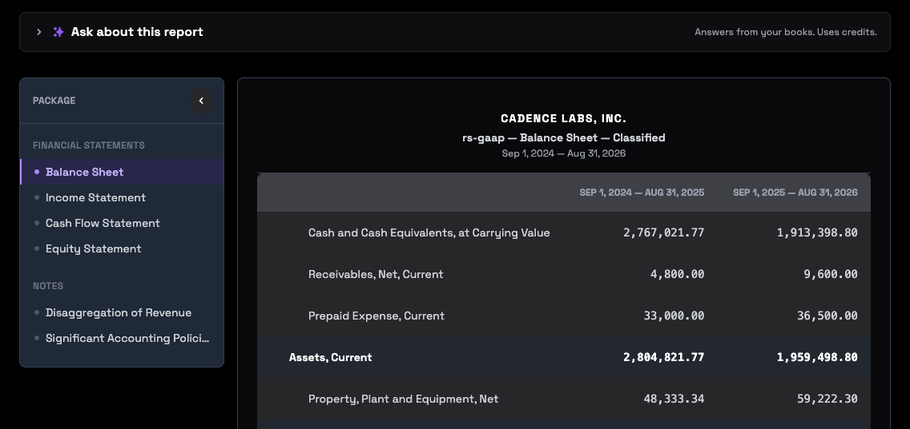

A report turns your ledger for a period into financial statements: the balance sheet, income statement, cash flow and statement of equity. It lives in your graph, and you choose who else gets a copy.

A report is a snapshot. Live statements move with every sync and every entry, and a report stays as it was when you created it. That's what makes it safe to send.

## Create a report

Ask your AI assistant, or open **Reports → Create Report**. The report is built from your mapped chart of accounts, so map your accounts first. See [Map your chart of accounts](map-your-chart-of-accounts.md).

In the app, choose the period: this month or last, this quarter or last, monthly year to date, a full year by month, year over year, or dates of your own. Then choose which statements to include.

- "Create a report for September."
- "Create a report for the third quarter and tell me anything that looks off."

## Read it

Open a report in **Reports → View Reports**. The statements, and any notes attached to the report, are listed on the left. Each one opens as a rendered statement, and you can switch to the facts behind it and the checks it passed.

**Ask about this report** answers questions from the report inside the app. It runs on RoboLedger's own AI, so it uses credits. Asking your assistant about the same report through your own connection doesn't.

If the ledger changed after you created a report, because of a late entry or a restated month, ask your assistant to regenerate it. The report is rebuilt from the ledger as it stands now.

## Download it

Open a report in **Reports → View Reports** to download it as:

- an **XBRL 2.1 package**, the standard behind public company filings
- a **JSON-LD bundle**
- a **holon** (JSON-LD) or **Tavi** (JSON) file, which open in the free viewer at [xbrlkit.com](https://xbrlkit.com)

## Share it

Sharing happens in the app, not through your assistant. Open a report, choose **Share**, and pick a publish list. A publish list is a set of graphs you send reports to, such as your investor's RoboInvestor graph or your advisor's RoboLedger graph. Manage lists under **Reports → Publish Lists**, and add a recipient by their graph ID. The recipient can copy it from their graph's **Dashboard** at [robosystems.ai](https://robosystems.ai). What the investor sees is in the [RoboInvestor docs](https://roboinvestor.ai/docs/reports-you-receive).

**The recipient gets the statement, never the ledger.** A shared report copies the report, its statements and their facts, and the report files. Your transactions, customers, vendors and journal entries stay in your graph.

If someone sends you reports you don't want, add them under **Reports → Blocked Senders**.

Someone without a RoboLedger or RoboInvestor graph can still read your report. Download the holon or Tavi file and send it to them. It opens in the free viewer at [xbrlkit.com](https://xbrlkit.com), in their browser, with no account.

## Try asking

- "Create a report for September and tell me anything that looks off."
- "What changed between the August and September reports?"
- "We posted a late entry to September. Regenerate the September report."

## Go deeper

- [What's inside each format](https://robosystems.ai/docs/technical/serialization-and-export#whats-inside-each-format): the contents of the XBRL, JSON-LD, holon and Tavi downloads.
