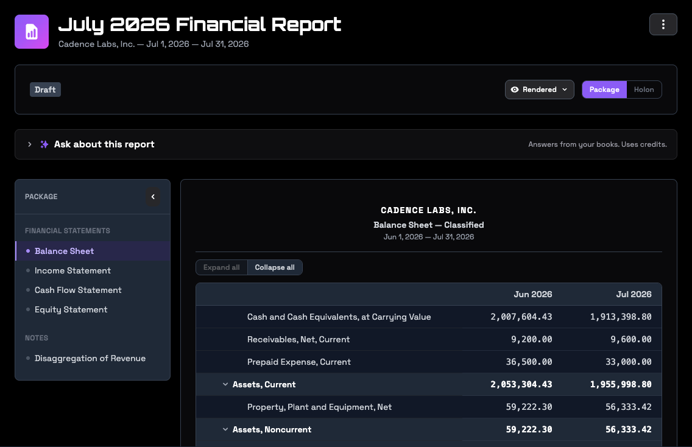

A report turns your ledger for a period into financial statements: the balance sheet, income statement, cash flow and statement of equity. It lives in your graph, and you choose who else gets a copy.

A report is a snapshot. Live statements move with every sync and every entry, and a report stays as it was when you created it. That's what makes it safe to send.

## Create a report

Ask your AI assistant, or open **Reports → Create Report**. The report is built from your mapped chart of accounts, so map your accounts first. See [Map your chart of accounts](map-your-chart-of-accounts.md).

In the app, choose the period: this month or last, this quarter or last, monthly year to date, the trailing twelve months by month, year over year, or dates of your own.

- "Create a report for September."
- "Create a report for the third quarter and tell me anything that looks off."

## Read it

Open a report in **Reports → View Reports**. The statements, and any notes attached to the report, are listed on the left. Each one opens as a rendered statement, and you can switch to the facts behind it and the checks it passed.

**Ask about this report** answers questions from the report inside the app. It runs on RoboLedger's own AI, so it uses credits. Asking your assistant about the same report through your own connection doesn't.

If the ledger changed after you created a report, because of a late entry or a restated month, regenerate it: ask your assistant, or open the report and choose **Regenerate** from its menu (⋮). The report is rebuilt from the ledger as it stands now. Copies you've already shared don't change.

## Download it

Open a report in **Reports → View Reports** and choose a format from its menu (⋮):

- **Holon (JSON-LD)**, the complete report. It opens in the free viewer at [xbrlkit.com](https://xbrlkit.com).
- **Tavi (JSON)**, a compiled model of the report, which also opens in that viewer. It leaves out some of what the holon carries, such as the report's filing status.
- **XBRL 2.1 package**, the standard behind public company SEC filings, for tools that read XBRL. It leaves out the report's notes.

**Which file to send.** Send the holon unless the person asks for something else. It is the only one that carries the whole report. Send the XBRL package to someone whose software needs XBRL, and the notes separately if they need them.

An assistant that works with files on your computer, such as Claude Code, can also fetch a short-lived link to a report and open it in a tool there. The link expires after a few minutes.

## File it

When the statements are final, file the report. Filing happens in the app, not through your assistant: open the report and choose **File report** from its menu (⋮).

A filed report is a record. It can't be regenerated or deleted, only archived, so wait to file if the books for the period may still change. To replace one, archive it and create a new report for the period. Filing rebuilds the report's downloads, so the files carry the filing date.

Before you file, the same menu marks a draft as under review, and returns it to draft.

Only the report's author, the person who created it or whose assistant did, can regenerate, file, archive, share or delete it. Everyone else with access to the graph can read and download it.

## Share it

Sharing happens in the app, not through your assistant. Open a report, choose **Share**, and pick a publish list. A publish list is a set of graphs you send reports to, such as your investor's RoboInvestor graph or your advisor's RoboLedger graph. Manage lists under **Reports → Publish Lists**, and add a recipient by their graph ID. The recipient can copy it from their graph's **Dashboard** at [robosystems.ai](https://robosystems.ai). What the investor sees is in the [RoboInvestor docs](https://roboinvestor.ai/docs/reports-you-receive).

A report shared before it's filed arrives marked as a draft or under review. File it first to send final statements. If you already shared it, share it again after filing.

**The recipient gets the statement, never the ledger.** A shared report copies the report, its statements and their facts, and the report files. Your transactions, customers, vendors and journal entries stay in your graph.

To withdraw a report, open it and choose **Manage shares**. Revoking a share deletes the recipient's copy from their graph. The report's author or a graph admin can revoke. A report that is still shared can't be deleted: revoke each share first.

If someone sends you reports you don't want, add them under **Reports → Blocked Senders**.

Someone without a RoboLedger or RoboInvestor graph can still read your report. Download the holon and send it to them. It opens in the free viewer at [xbrlkit.com](https://xbrlkit.com), in their browser, with no account.

## Try asking

- "Create a report for September and tell me anything that looks off."
- "What changed between the August and September reports?"
- "We posted a late entry to September. Regenerate the September report."

## Go deeper

- [What's inside each format](https://robosystems.ai/docs/technical/serialization-and-export#whats-inside-each-format): the contents of the holon, Tavi and XBRL downloads.
