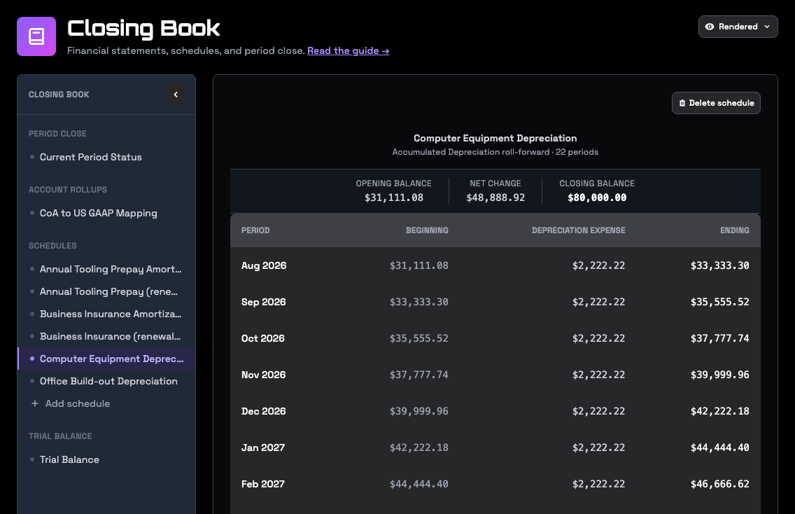

Some entries are the same every month: depreciation on equipment, amortization of software or a loan fee, a prepaid insurance policy rolling off. In RoboLedger each one is a schedule. You set it up once, every close drafts its entry for you to review, and every forecast keeps it running until it ends.

## What a schedule is

A schedule books one amount, from one account to another, every month from a first month to a last month.

- **One debit account and one credit account.** Depreciation on three classes of equipment is three schedules, one for each.
- **A first and last month.** Schedules are finite. Depreciation runs for the asset's useful life, and a prepaid runs until it's used up.
- **A monthly amount.** By default the amount is the same every month, and the final month takes up any rounding. An amortization that isn't even, like a loan fee under the effective interest method, takes an amount for each month instead.
- **The original cost, if you have it.** With a cost, useful life and salvage value, RoboLedger also checks that the schedule adds up to what it should. Without them it books the monthly amount and that's all. You can add the detail later.

## Set one up

**With your AI assistant.** Describe the asset or the prepaid, and your assistant sets up the schedule with your accounts. It can read a past month's entries to find the amounts and accounts you already use. History shows what was booked, not why, so it asks you for what it can't see: the cost, the useful life, the method, and when it started. If you keep a depreciation or prepaid worksheet, give your assistant the numbers from it.

**In the app.** Open **Ledger → Closing Book** and choose **Add schedule**. Pick the debit and credit accounts, the first and last period, and the monthly amount. For depreciation, add the original cost, useful life in months and salvage value. The preview shows the entry before you save.

Months that are already closed are treated as history. A schedule that began two years ago starts drafting entries from your first open month, and doesn't try to book the months behind it again.

## What happens at each close

When you close a month, every active schedule gets a draft entry for that month. Your assistant shows you the drafts with everything else, and they post when you approve the close. Entries from schedules are written to QuickBooks at the close, like other entries RoboLedger posts. See [Close the month with your AI assistant](month-end-close.md) and [Nothing writes to QuickBooks until you post](quickbooks-write-back.md).

In **Ledger → Closing Book**, each schedule shows its months and amounts. The period close view lists the month's schedule entries and where each one stands, with a button to draft any that are still pending.

## End a schedule early

An asset gets sold. A policy gets cancelled and refunded. End the schedule before you draft that month's entries, or the close drafts an entry that shouldn't exist.

- **End it with no entry.** The schedule stops at the end of a month you choose. Use this when the sale or refund is already in your books.
- **End it and book the disposal.** Your assistant posts the disposal entry and ends the schedule in one step. Use this when that entry still needs to be made.

Ending a schedule keeps its history. Deleting a schedule erases it, so end a schedule that did real work and delete only one that was set up by mistake.

## Change a schedule

Changes apply going forward. Entries that already posted stay posted. To correct a month that's closed, reopen it, post a correcting entry, and close it again.

## Schedules in a forecast

Every scenario picks up your schedules. Depreciation and amortization continue at their scheduled amounts, the assets they belong to come down on the balance sheet, and the expense stops in the month the schedule ends. See [Plan and forecast with your AI assistant](plan-and-forecast.md).

## Try asking

- "Look at last year's closing entries and tell me which ones should be schedules."
- "Set up straight line depreciation for the delivery van: 38,000 cost, five years, 2,000 salvage, in service since March."
- "We prepaid 12,000 of insurance in July for twelve months. Set up the schedule."
- "We sold the van on September 30. End its depreciation schedule and book the disposal."
- "Which schedules end in the next six months?"

## Go deeper

- [Authoring an information block](https://robosystems.ai/docs/technical/information-blocks#authoring-an-information-block): a schedule created, read back and verified through the API.
