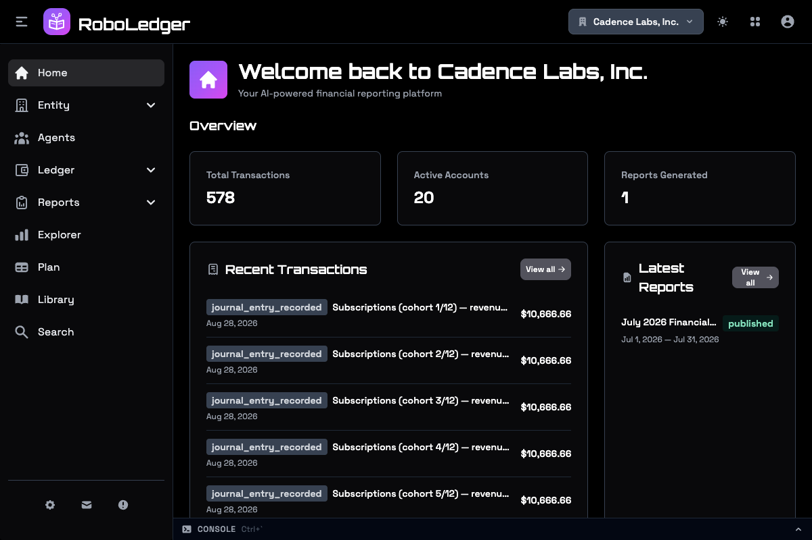
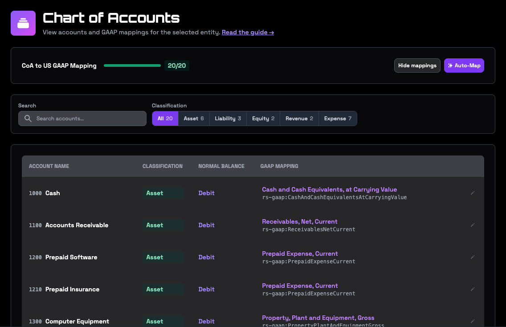
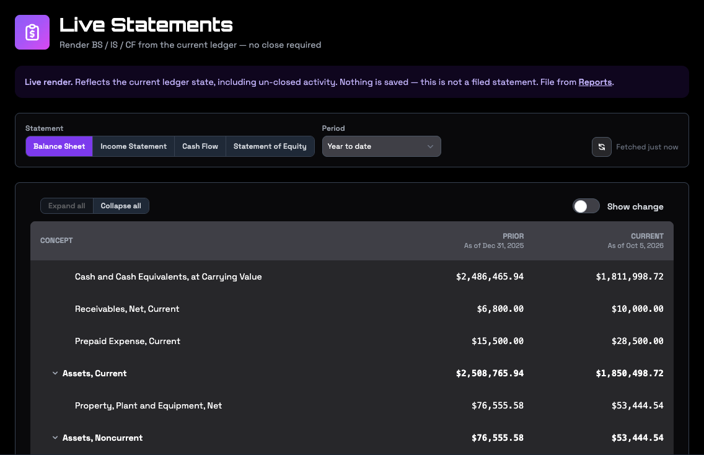
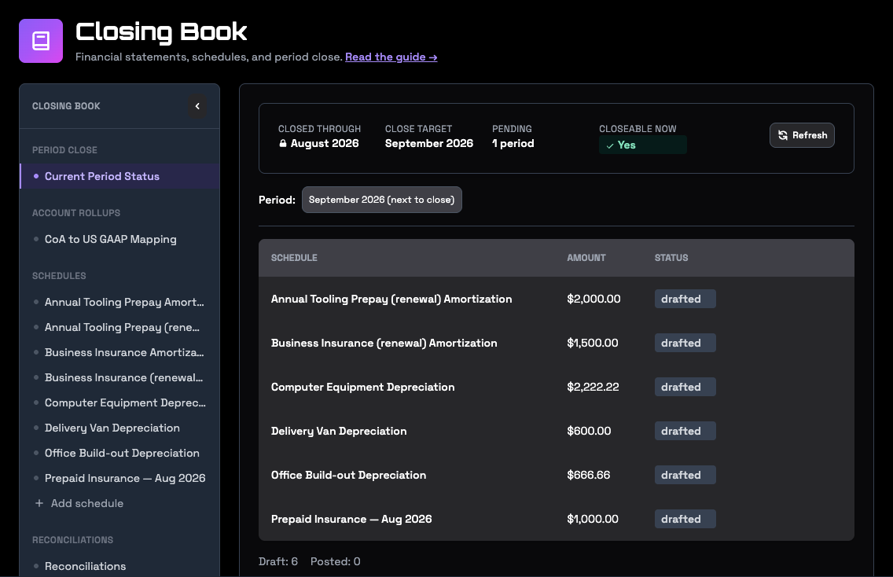
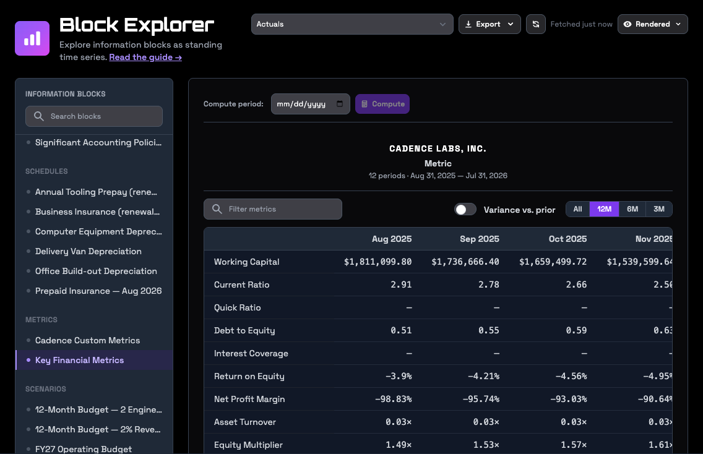

Most of the work in RoboLedger happens in a conversation with your AI assistant: Claude, ChatGPT or any MCP client. The app at [roboledger.ai](https://roboledger.ai) is where you connect your books, see what your assistant is working from, and review what it did. Your books, reports and plans are all here, and graph admins can see every change made to the graph on the **Activity** page at robosystems.ai.

The screens below show Cadence Labs, a made-up company used for demos.

The menu at the top right picks the company you're looking at, if you have more than one. **Home** shows recent transactions, your latest reports and shortcuts.

## Entity

- **Entity Info** holds your company's details.
- **All Entities** lists every company across your graphs.
- **Connections** is where you connect QuickBooks, press **Sync Now**, choose sync options, and disconnect. See [Connect your books to your AI assistant](connect-your-books.md).

## Agents

The people and companies you do business with: customers, vendors and employees. They come over from QuickBooks, and each one opens to its details and activity.

## Ledger

**Chart of Accounts** lists your accounts. **Show mappings** adds the reporting concept each account is mapped to, and the bar at the top shows how much of the chart is covered. See [Map your chart of accounts](map-your-chart-of-accounts.md).

**Inbox** holds events that have been captured and haven't posted to the ledger yet, so you can review and approve them first. See [Review events in the Inbox](inbox.md).

**Journal** is every journal entry with its lines, in posting order, and a second tab for transactions. You can create a manual entry here, and each row offers what its entry allows:

- **A draft you entered by hand** can be edited or deleted. It stays a draft until the month closes.
- **A posted entry** can be reversed. The reversal posts on the date you choose with every debit and credit swapped, and the original is marked reversed. An entry is reversed once.

An entry in a closed month can't be changed until the month is reopened. While QuickBooks is connected, an entry synced from it is corrected in QuickBooks. While QuickBooks is also your book of record, which is the default, every posted entry is: a reversal posted in RoboLedger alone would leave the two ledgers disagreeing. See [Nothing writes to QuickBooks until you post](quickbooks-write-back.md).

**Trial Balance** shows each account's debits and credits, and whether they agree.

**Statements** shows the balance sheet, income statement, cash flow and statement of equity straight from the current ledger, for any period. Nothing is saved, and no close is needed.

**Closing Book** is where the month-end close lives. The period close view shows the last closed month, the month you're working towards, what's blocking it, and each schedule's entry for the month. Beside it are the statements from your latest report, your account rollups, your schedules, your reconciliations with the transactions that changed in QuickBooks after a sync, and the trial balance. See [Close the month with your AI assistant](month-end-close.md), [Schedules for recurring entries](schedules.md), [Reconcile your accounts](reconcile-your-accounts.md) and [When QuickBooks changes after a sync](changes-after-sync.md).

## Reports

- **View Reports** lists the reports you've created. Open one to read its statements and notes, download it, share it, regenerate it, or file it once it's final.
- **Create Report** builds a report for a period: this month or last, this quarter or last, monthly year to date, a full year by month, year over year, or dates you choose.
- **Publish Lists** are the sets of graphs you send reports to.
- **Blocked Senders** are graphs you don't accept reports from.

See [Reports and sharing](reports-and-sharing.md).

## Explorer

Explorer opens any statement, note, schedule, set of ratios or scenario as a series over time. Switch between the rendered table, a chart, the facts behind it, the accounts and concepts it's built from, the checks it passed and the rules behind them. Export its table as CSV or JSON. See [Explore statements and metrics over time](explorer.md).

## Plan

Your statements and a scenario's assumptions in one monthly grid, with actual months on the left and forecast months on the right. See [Plan and forecast with your AI assistant](plan-and-forecast.md).

## Library

The reporting concepts your accounts map to, with their definitions and how they roll up into each statement. Look here when you're deciding where an account belongs. See [The reporting library](the-library.md).

## Console

Ask questions about your books inside the app, from the Console bar at the bottom of every page. Start a request with `/do` to have it make a change: add a metric block or run a forecast, add or update a customer or vendor, remember something, draft a report, or draft the schedule entries that are due. It lists what it changed, and Plan and Explorer refresh to show it. Filing or sharing a report, closing a period, posting entries and deleting stay out of the Console. The Console runs on RoboLedger's own AI, so questions and changes use credits from your plan's monthly allowance. Claude, ChatGPT and other clients you connect yourself don't use credits.

## Search

Finds text across the documents in your graph, such as accounting policies and close procedures.

## Your account

Your RoboSystems account at [robosystems.ai](https://robosystems.ai) holds the rest:

- your password, passkeys and API keys, under **User Settings**
- your organization's members, and its billing for owners and admins
- each graph's credits, on the **Usage** page
- each graph's **Activity**: every change made to it, who made it, and whether it came through an MCP client, the app or API, or the Console. Graph admins see it.
- the **MCP** page, with the address to connect any graph

The user menu at the top right takes you there.
