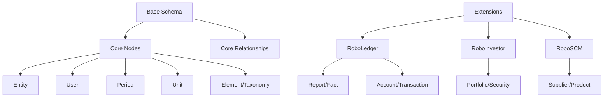

# RoboSystems Kuzu Graph Schema System

## Overview

The RoboSystems schema system provides a comprehensive, extensible framework for defining graph database structures in Kuzu. It implements a **base + extensions** architecture that enables modular, domain-specific data modeling while maintaining consistency and compatibility across different application contexts.

**Key Features:**

- **Modular Architecture**: Base schema + pluggable extensions for different domains
- **Context-Aware Loading**: Different views of the same schema based on use case
- **Type-Safe Validation**: Strong typing with Kuzu-native data types
- **Custom Schema Support**: JSON/YAML-based custom schema definitions
- **Production-Ready**: Used in multi-tenant enterprise deployments

## Architecture

### Core Components

```
robosystems/schemas/
├── models.py           # Data structures (Node, Relationship, Property, Schema)
├── base.py            # Foundation schema (entities, users, taxonomy)
├── builder.py         # Schema compilation and DDL generation
├── manager.py         # Extension management and compatibility
├── loader.py          # Context-aware schema loading
├── validator.py       # Schema validation and consistency checks
├── installer.py       # Database schema installation
├── custom.py          # Custom schema support (JSON/YAML)
└── extensions/        # Domain-specific extensions
    ├── roboledger.py  # Financial reporting & accounting
    ├── roboinvestor.py # Portfolio & investment management
    ├── roboscm.py     # Supply chain management
    ├── robofo.py      # Front office & CRM
    ├── roboepm.py     # Enterprise performance management
    ├── robohrm.py     # Human resources management
    └── roboreport.py  # Regulatory compliance
```

### Schema Hierarchy



## Base Schema

The base schema (`base.py`) provides foundational nodes and relationships that all applications share:

### Core Nodes

| Node              | Purpose                                | Key Properties                                 |
| ----------------- | -------------------------------------- | ---------------------------------------------- |
| **GraphMetadata** | Database metadata and configuration    | identifier, graph_id, tier, schema_type        |
| **User**          | System users with authentication       | identifier, email, is_active                   |
| **Entity**        | Organizations, companies, subsidiaries | identifier, cik, ticker, name, entity_type     |
| **Period**        | Time periods for data                  | start_date, end_date, fiscal_year, period_type |
| **Unit**          | Measurement units                      | measure, value, numerator_uri                  |
| **Connection**    | External system integrations           | provider, connection_id, status                |
| **Element**       | XBRL taxonomy elements                 | qname, period_type, is_numeric                 |
| **Label**         | Human-readable element labels          | value, type, language                          |
| **Reference**     | Authoritative element references       | value, type                                    |
| **Taxonomy**      | Global XBRL taxonomies                 | name, version, namespace                       |

### Core Relationships

- **USER_HAS_ACCESS** → Entity: Access control and permissions
- **ENTITY_HAS_CONNECTION** → Connection: External integrations
- **ENTITY_OWNS_ENTITY** → Entity: Hierarchical ownership
- **ELEMENT_HAS_LABEL** → Label: Human-readable descriptions
- **ELEMENT_IN_TAXONOMY** → Taxonomy: Taxonomy membership

## Extension Schemas

### RoboLedger - Financial Reporting & Accounting

**Unified schema with context-aware loading:**

#### Reporting Section (SEC/XBRL)

- **Nodes**: Report, Fact, Structure, FactDimension, Association, FactSet
- **Use Cases**: SEC repositories, financial statements, XBRL processing
- **Key Features**: Dimensional analysis, fact aggregation, taxonomy navigation

#### Transaction Section (General Ledger)

- **Nodes**: Account, Transaction, LineItem, Process, Disclosure
- **Use Cases**: Entity accounting, journal entries, trial balances
- **Key Features**: Double-entry bookkeeping, account hierarchies, audit trails

#### Context-Aware Loading

```python
# SEC Repository - Reporting only
loader = get_contextual_schema_loader("repository", "sec")

# Entity Database - Full accounting
loader = get_contextual_schema_loader("application", "roboledger")
```

### RoboInvestor - Portfolio Management

**Investment tracking and analysis:**

- **Nodes**: Portfolio, Security, Position, Trade, Benchmark, MarketData, Dividend, Risk
- **Relationships**: Portfolio positions, trade history, security pricing
- **Key Features**:
  - Multi-portfolio management
  - Real-time position tracking
  - Performance benchmarking
  - Risk assessment

### RoboSCM - Supply Chain Management

**End-to-end supply chain operations:**

- **Nodes**: Supplier, Product, Warehouse, Inventory, PurchaseOrder, Contract, Shipment, Demand
- **Supporting Nodes**: Contact, Address
- **Key Features**:
  - Supplier relationship management
  - Inventory optimization
  - Purchase order workflow
  - Demand forecasting
  - Logistics tracking

### RoboFO - Front Office & CRM

**Sales and marketing operations:**

- **Nodes**: Lead, Customer, Contact, Opportunity, Campaign, Activity, Quote
- **Key Features**:
  - Lead scoring and conversion
  - Opportunity pipeline management
  - Campaign effectiveness tracking
  - Customer segmentation

### RoboEPM - Enterprise Performance Management

**Strategic planning and performance:**

- **Nodes**: KPI, Budget, Forecast, Scorecard, Initiative
- **Key Features**:
  - KPI tracking and dashboards
  - Budget vs. actual analysis
  - Rolling forecasts
  - Strategic initiative management

### RoboHRM - Human Resources Management

**Workforce and talent management:**

- **Nodes**: Employee, Department, Position, Payroll, Benefit, TimeOff
- **Key Features**:
  - Organizational hierarchy
  - Compensation management
  - Benefits administration
  - Time and attendance

### RoboReport - Regulatory Compliance

**Compliance and filing management:**

- **Nodes**: Regulation, Filing, Submission, Audit, Control
- **Key Features**:
  - Regulatory requirement tracking
  - Filing deadline management
  - Compliance audit trails
  - Control effectiveness

## Schema Management

### Loading Schemas

```python
from robosystems.schemas.loader import get_schema_loader

# Load all extensions (backward compatible)
loader = get_schema_loader()

# Load specific extensions
loader = get_schema_loader(extensions=["roboledger", "roboinvestor"])

# Context-aware loading for SEC repository
loader = get_contextual_schema_loader("repository", "sec")
```

### Building Schemas

```python
from robosystems.schemas.builder import KuzuSchemaBuilder

config = {
    "name": "My Financial Graph",
    "base_schema": "base",
    "extensions": ["roboledger", "roboinvestor"]
}

builder = KuzuSchemaBuilder(config)
builder.load_schemas()
cypher_ddl = builder.generate_cypher()
```

### Schema Validation

```python
from robosystems.schemas.validator import KuzuSchemaValidator

validator = KuzuSchemaValidator()

# Validate node properties
validator.validate_node("Entity", {
    "identifier": "entity123",
    "name": "Acme Corp",
    "cik": "0001234567"
})

# Validate relationships
validator.validate_relationship(
    "Entity", "Report", "ENTITY_HAS_REPORT",
    {"filing_context": "10-K"}
)
```

## Custom Schemas

The system supports user-defined schemas through JSON or YAML:

```json
{
  "name": "CustomAnalytics",
  "version": "1.0.0",
  "extends": "base",
  "nodes": [
    {
      "name": "Metric",
      "description": "Custom business metrics",
      "properties": [
        {
          "name": "id",
          "type": "STRING",
          "is_primary_key": true
        },
        {
          "name": "value",
          "type": "DOUBLE"
        }
      ]
    }
  ],
  "relationships": [
    {
      "name": "ENTITY_HAS_METRIC",
      "from_node": "Entity",
      "to_node": "Metric"
    }
  ]
}
```

### Loading Custom Schemas

```python
from robosystems.schemas.custom import CustomSchemaManager

manager = CustomSchemaManager()
schema = manager.create_from_json(json_string)
merged = manager.merge_with_base(schema)
```

## Data Types

### Supported Kuzu Types

| Category     | Types                                    | Usage                    |
| ------------ | ---------------------------------------- | ------------------------ |
| **Strings**  | STRING                                   | Names, identifiers, text |
| **Numbers**  | INT8, INT16, INT32, INT64, DOUBLE, FLOAT | Quantities, amounts      |
| **Temporal** | DATE, TIMESTAMP, INTERVAL                | Time-based data          |
| **Boolean**  | BOOLEAN                                  | Flags, states            |
| **Special**  | UUID, BLOB                               | Unique IDs, binary data  |
| **Complex**  | LIST, MAP, STRUCT, UNION                 | Structured data          |

### Type Mappings

```python
# Property definition with types
Property(name="amount", type="DOUBLE")
Property(name="filing_date", type="DATE")
Property(name="is_active", type="BOOLEAN")
Property(name="identifier", type="STRING", is_primary_key=True)
```

## Schema Compatibility

The `SchemaManager` provides compatibility checking for extension combinations:

```python
from robosystems.schemas.manager import SchemaManager

manager = SchemaManager()

# Check compatibility
compatibility = manager.check_schema_compatibility([
    "roboledger", "roboinvestor"
])

if compatibility.compatible:
    print("Extensions are compatible")
else:
    print(f"Conflicts: {compatibility.conflicts}")
```

## Production Usage

### Multi-Tenant Deployment

```python
# Standard tier - Multiple databases per instance
config_standard = {
    "extensions": ["roboledger"],  # Minimal extensions
    "tier": "standard"
}

# Enterprise tier - Isolated instances
config_enterprise = {
    "extensions": ["roboledger", "roboinvestor", "roboepm"],
    "tier": "enterprise"
}
```

### SEC Repository Configuration

```python
# SEC public data repository
# Uses reporting-only view to prevent MCP agent confusion
loader = get_contextual_schema_loader("repository", "sec")

# This filters out transaction tables that don't exist in SEC data
# Ensures AI agents only see relevant XBRL/reporting tables
```

### Entity Database Configuration

```python
# Full enterprise accounting system
loader = get_contextual_schema_loader("application", "roboledger")

# Multi-application deployment
config = {
    "name": "Enterprise Suite",
    "extensions": ["roboledger", "roboinvestor", "roboscm"]
}
```

## Schema Evolution

### Safe Schema Updates

The system uses `CREATE TABLE IF NOT EXISTS` to prevent data loss:

```python
# Schema changes require migration scripts
# Never use DROP/CREATE in production

# Safe addition of new nodes/relationships
CREATE NODE TABLE IF NOT EXISTS NewNode(...)

# For schema modifications, use Kuzu ALTER commands
ALTER TABLE Entity ADD COLUMN new_field STRING
```

### Migration Strategy

1. **Additive Changes**: New nodes/relationships can be added safely
2. **Property Additions**: Use ALTER TABLE to add new properties
3. **Breaking Changes**: Require coordinated migration scripts
4. **Version Tracking**: Track schema versions in GraphMetadata

## Best Practices

### 1. Extension Selection

- **Start Minimal**: Begin with base + essential extensions
- **Add Incrementally**: Add extensions as features are needed
- **Consider Performance**: More extensions = larger schema overhead

### 2. Context-Aware Loading

- **SEC Repositories**: Always use reporting-only context
- **Entity Databases**: Use full context for complete functionality
- **API Endpoints**: Match schema loading to endpoint requirements

### 3. Custom Schemas

- **Extend, Don't Replace**: Build on base schema for compatibility
- **Avoid Reserved Names**: Check RESERVED_NODE_NAMES in custom.py
- **Validate Early**: Test custom schemas in development first

### 4. Performance Optimization

- **Index Primary Keys**: All primary keys are automatically indexed
- **Minimize Properties**: Only include necessary properties
- **Batch Operations**: Use bulk loading for initial data

### 5. Security Considerations

- **Access Control**: Implement at USER_HAS_ACCESS relationship
- **Data Isolation**: Multi-tenant separation at database level
- **Audit Trails**: Track all schema modifications

## Troubleshooting

### Common Issues

| Issue                            | Cause                   | Solution                           |
| -------------------------------- | ----------------------- | ---------------------------------- |
| **Duplicate node names**         | Extension conflicts     | Check compatibility before loading |
| **Missing primary key**          | Schema definition error | Ensure all nodes have identifier   |
| **Relationship reference error** | Node doesn't exist      | Load required extensions           |
| **Context loading fails**        | Unsupported context     | Use predefined contexts only       |

### Debugging

```python
# Enable debug logging
import logging
logging.basicConfig(level=logging.DEBUG)

# Inspect loaded schema
loader = get_schema_loader(extensions=["roboledger"])
print(f"Loaded nodes: {loader.list_node_types()}")
print(f"Loaded relationships: {loader.list_relationship_types()}")

# Validate schema consistency
from robosystems.schemas.manager import SchemaManager
manager = SchemaManager()
manager._validate_schema_consistency(schema)
```

## API Integration

The schema system integrates with the RoboSystems API:

### Graph Operations

- Schema installation during database creation
- Validation before data ingestion
- Query generation based on schema

### MCP Integration

- Context-aware schema exposure to AI agents
- Natural language to Cypher query generation
- Schema-guided response formatting
