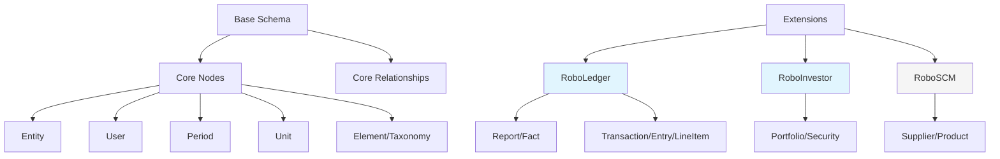

# RoboSystems Schema Extensions

## Overview

The RoboSystems schema system implements a **base + extensions** architecture for defining graph database structures in LadybugDB. Each extension defines a domain schema — the node types, relationships, and properties that model a specific business domain. This schema is the foundation that drives everything built on top of it: OLTP databases, API routes, data pipelines, and frontend applications.

**Key Concepts:**

- **Base Schema**: Core nodes shared by all graphs (Entity, User, Period, Unit, Element, Taxonomy)
- **Extensions**: Domain schemas that extend the base schema with domain-specific node types and relationships
- **Context-Aware Loading**: Different views of the same extension based on use case (e.g., SEC reporting vs full accounting)
- **Product Extensions**: Extensions like RoboLedger and RoboInvestor that grow beyond the graph schema into full product verticals with dedicated databases, API surfaces, data pipelines, and frontend applications

## How Extensions Work

Each extension defines the domain model for its application — the node types, relationships, and properties that the application understands. The extension schema is the single source of truth that drives:

1. **Graph Database Structure**: Node tables and relationship tables in LadybugDB
2. **OLTP Database Schema**: PostgreSQL tables that mirror the schema for transactional workloads
3. **API Surface**: Endpoints that expose and operate on the domain model
4. **Data Pipelines**: ETL/ELT jobs that transform external data into the schema
5. **AI Agent Context**: MCP tools use the schema to understand what queries are valid
6. **Frontend Applications**: UI components are built around the domain model

Not every extension has all of these layers today. Some are schema-only (graph schema). Others — RoboLedger and RoboInvestor — have grown into full product extensions with dedicated infrastructure.

### Product Extensions vs Schema Extensions

| Layer | Schema Extension | Product Extension |
|-------|-----------------|-------------------|
| Graph schema | Yes | Yes |
| OLTP database | No | Yes (schema-per-tenant PostgreSQL) |
| API routes | No | Yes (feature-flagged, base name) |
| Data pipelines | No | Yes (Dagster assets, dbt models) |
| Frontend app | No | Yes (dedicated app, own domain) |
| Trademark / brand | No | Yes |

**Current product extensions:**

| Extension | Product | App | Domain |
|-----------|---------|-----|--------|
| `roboledger` | RoboLedger | [roboledger.ai](https://roboledger.ai) | Accounting, financial reporting, general ledger |
| `roboinvestor` | RoboInvestor | [roboinvestor.ai](https://roboinvestor.ai) | Portfolio management, investment tracking |

**Current schema-only extensions:**

| Extension | Domain |
|-----------|--------|
| `roboscm` | Supply chain management |
| `robofo` | Front office & CRM |
| `roboepm` | Enterprise performance management |
| `robohrm` | Human resources management |
| `roboreport` | Regulatory compliance |
| `memory` | AI memory (concepts, observations, sessions) |

### Naming Convention

The extension name (e.g., `roboledger`) is the product domain. API routes and feature flags use the **base name** (e.g., `ledger`) because a product extension can contain multiple functional surfaces:

```
roboledger (extension / product)
├── /v1/ledger/*         → LEDGER_ENABLED
├── /v1/reports/*        → REPORTS_ENABLED        (future)
├── /v1/classification/* → CLASSIFICATION_ENABLED  (future)
└── /v1/bank-feeds/*     → BANK_FEEDS_ENABLED      (future)

roboinvestor (extension / product)
├── /v1/investor/*       → INVESTOR_ENABLED        (future)
└── /v1/market-data/*    → MARKET_DATA_ENABLED     (future)
```

The extension groups them. The base names stay functional.

## Architecture

### Core Components

```
robosystems/schemas/
├── models.py           # Data structures (Node, Relationship, Property, Schema)
├── base.py            # Foundation schema (entities, users, taxonomy)
├── builder.py         # Schema compilation and DDL generation
├── manager.py         # Extension management and compatibility
├── loader.py          # Context-aware schema loading
├── validator.py       # Schema validation and consistency checks
├── installer.py       # Database schema installation
├── custom.py          # Custom schema support (JSON/YAML)
└── extensions/        # Domain-specific extensions
    ├── roboledger.py  # Financial reporting & accounting
    ├── roboinvestor.py # Portfolio & investment management
    ├── roboscm.py     # Supply chain management
    ├── robofo.py      # Front office & CRM
    ├── roboepm.py     # Enterprise performance management
    ├── robohrm.py     # Human resources management
    ├── roboreport.py  # Regulatory compliance
    └── memory.py      # AI memory schema
```

### Schema Hierarchy


```mermaid
graph TD
    A[Base Schema] --> B[Core Nodes]
    A --> C[Core Relationships]
    B --> D[Entity]
    B --> E[User]
    B --> F[Period]
    B --> G[Unit]
    B --> H[Element/Taxonomy]

    I[Extensions] --> J[RoboLedger]
    I --> K[RoboInvestor]
    I --> L[RoboSCM]

    J --> M[Report/Fact]
    J --> N[Transaction/Entry/LineItem]
    K --> O[Portfolio/Security]
    L --> P[Supplier/Product]

    style J fill:#e1f5fe
    style K fill:#e1f5fe
    style L fill:#f5f5f5
```

## Base Schema

The base schema (`base.py`) provides foundational nodes and relationships that all applications share:

### Core Nodes

| Node              | Purpose                                | Key Properties                                 |
| ----------------- | -------------------------------------- | ---------------------------------------------- |
| **GraphMetadata** | Database metadata and configuration    | identifier, graph_id, tier, schema_type        |
| **User**          | System users with authentication       | identifier, email, is_active                   |
| **Entity**        | Organizations, companies, subsidiaries | identifier, cik, ticker, name, entity_type     |
| **Period**        | Time periods for data                  | start_date, end_date, fiscal_year, period_type |
| **Unit**          | Measurement units                      | measure, value, numerator_uri                  |
| **Element**       | XBRL taxonomy elements                 | qname, period_type, is_numeric                 |
| **Label**         | Human-readable element labels          | value, type, language                          |
| **Reference**     | Authoritative element references       | value, type                                    |
| **Taxonomy**      | Global XBRL taxonomies                 | name, version, namespace                       |

### Core Relationships

- **ENTITY_OWNS_ENTITY** → Entity: Hierarchical ownership
- **ELEMENT_HAS_LABEL** → Label: Human-readable descriptions
- **ELEMENT_IN_TAXONOMY** → Taxonomy: Taxonomy membership

## Extension Schemas

### RoboLedger — Financial Reporting & Accounting

The RoboLedger extension models the full accounting domain: financial reporting (XBRL/SEC), general ledger (transactions, journal entries), and chart of accounts (via Element/Association patterns). It uses context-aware loading to present different views depending on the use case.

**Full product extension** with OLTP tables in the `extensions` database (schema-per-tenant), API routes (`/v1/ledger/*`), QuickBooks ELT pipeline, and dedicated frontend app.

#### Reporting Section (SEC/XBRL)

- **Nodes**: Report, Fact, Structure, Association, FactSet
- **Use Cases**: SEC repositories, financial statements, XBRL processing
- **Key Features**: Dimensional analysis, fact aggregation, taxonomy navigation

#### Transaction Section (General Ledger)

- **Nodes**: Transaction, Entry, LineItem
- **Use Cases**: Entity accounting, journal entries, trial balances
- **Key Features**: Three-level model (Transaction → Entry → LineItem), dimensional tagging (department, class, location)
- **Note**: Chart of accounts is represented via Element/Association pattern (shared with Reporting Section)

#### Context-Aware Loading

```python
# SEC Repository — reporting only (hides transaction tables from AI agents)
loader = get_contextual_schema_loader("repository", "sec")

# Entity Database — full accounting
loader = get_contextual_schema_loader("application", "roboledger")
```

### RoboInvestor — Portfolio Management

The RoboInvestor extension models portfolio management, securities, trading, and risk analysis. Currently a schema extension with a dedicated frontend app; OLTP database and API routes are planned.

- **Nodes**: Portfolio, Security, Position, Trade, Benchmark, MarketData, Dividend, Risk
- **Relationships**: Portfolio positions, trade history, security pricing
- **Key Features**:
  - Multi-portfolio management
  - Real-time position tracking
  - Performance benchmarking
  - Risk assessment

### RoboSCM — Supply Chain Management

- **Nodes**: Supplier, Product, Warehouse, Inventory, PurchaseOrder, Contract, Shipment, Demand
- **Supporting Nodes**: Contact, Address
- **Key Features**: Supplier management, inventory optimization, purchase order workflow, demand forecasting, logistics tracking

### RoboFO — Front Office & CRM

- **Nodes**: Lead, Customer, Contact, Opportunity, Campaign, Activity, Quote
- **Key Features**: Lead scoring and conversion, opportunity pipeline, campaign tracking, customer segmentation

### RoboEPM — Enterprise Performance Management

- **Nodes**: KPI, Budget, Forecast, Scorecard, Initiative
- **Key Features**: KPI dashboards, budget vs. actual analysis, rolling forecasts, strategic initiative management

### RoboHRM — Human Resources Management

- **Nodes**: Employee, Department, Position, Payroll, Benefit, TimeOff
- **Key Features**: Organizational hierarchy, compensation, benefits administration, time and attendance

### RoboReport — Regulatory Compliance

- **Nodes**: Regulation, Filing, Submission, Audit, Control
- **Key Features**: Regulatory requirement tracking, filing deadline management, compliance audit trails, control effectiveness

### Memory — AI Memory Schema

- **Nodes**: Concept, Observation, Session
- **Key Features**: AI knowledge graph for storing concepts and observations across agent sessions

## Schema Management

### Loading Schemas

```python
from robosystems.schemas.loader import get_schema_loader

# Load all extensions (backward compatible)
loader = get_schema_loader()

# Load specific extensions
loader = get_schema_loader(extensions=["roboledger", "roboinvestor"])

# Context-aware loading for SEC repository
loader = get_contextual_schema_loader("repository", "sec")
```

### Building Schemas

```python
from robosystems.schemas.builder import LadybugDBSchemaBuilder

config = {
    "name": "My Financial Graph",
    "base_schema": "base",
    "extensions": ["roboledger", "roboinvestor"]
}

builder = LadybugDBSchemaBuilder(config)
builder.load_schemas()
cypher_ddl = builder.generate_cypher()
```

### Schema Validation

```python
from robosystems.schemas.validator import LadybugDBSchemaValidator

validator = LadybugDBSchemaValidator()

# Validate node properties
validator.validate_node("Entity", {
    "identifier": "entity123",
    "name": "Acme Corp",
    "cik": "0001234567"
})

# Validate relationships
validator.validate_relationship(
    "Entity", "Report", "ENTITY_HAS_REPORT",
    {"filing_context": "10-K"}
)
```

## Custom Schemas

The system supports user-defined schemas through JSON or YAML:

```json
{
  "name": "CustomAnalytics",
  "version": "1.0.0",
  "extends": "base",
  "nodes": [
    {
      "name": "Metric",
      "description": "Custom business metrics",
      "properties": [
        {
          "name": "id",
          "type": "STRING",
          "is_primary_key": true
        },
        {
          "name": "value",
          "type": "DOUBLE"
        }
      ]
    }
  ],
  "relationships": [
    {
      "name": "ENTITY_HAS_METRIC",
      "from_node": "Entity",
      "to_node": "Metric"
    }
  ]
}
```

### Loading Custom Schemas

```python
from robosystems.schemas.custom import CustomSchemaManager

manager = CustomSchemaManager()
schema = manager.create_from_json(json_string)
merged = manager.merge_with_base(schema)
```

## Data Types

### Supported LadybugDB Types

| Category     | Types                                    | Usage                    |
| ------------ | ---------------------------------------- | ------------------------ |
| **Strings**  | STRING                                   | Names, identifiers, text |
| **Numbers**  | INT8, INT16, INT32, INT64, DOUBLE, FLOAT | Quantities, amounts      |
| **Temporal** | DATE, TIMESTAMP, INTERVAL                | Time-based data          |
| **Boolean**  | BOOLEAN                                  | Flags, states            |
| **Special**  | UUID, BLOB                               | Unique IDs, binary data  |
| **Complex**  | LIST, MAP, STRUCT, UNION                 | Structured data          |

### Type Mappings

```python
# Property definition with types
Property(name="amount", type="DOUBLE")
Property(name="filing_date", type="DATE")
Property(name="is_active", type="BOOLEAN")
Property(name="identifier", type="STRING", is_primary_key=True)
```

## Schema Compatibility

The `SchemaManager` provides compatibility checking for extension combinations:

```python
from robosystems.schemas.manager import SchemaManager

manager = SchemaManager()

# Check compatibility
compatibility = manager.check_schema_compatibility([
    "roboledger", "roboinvestor"
])

if compatibility.compatible:
    print("Extensions are compatible")
else:
    print(f"Conflicts: {compatibility.conflicts}")
```

## Production Usage

### Multi-Tenant Deployment

```python
# Standard tier — single product extension
config_standard = {
    "extensions": ["roboledger"],
    "tier": "standard"
}

# Large tier — multiple product extensions with subgraph support
config_large = {
    "extensions": ["roboledger", "roboinvestor", "roboepm"],
    "tier": "large"
}
```

### SEC Repository Configuration

```python
# SEC public data repository
# Uses reporting-only view to prevent MCP agent confusion
loader = get_contextual_schema_loader("repository", "sec")

# This filters out transaction tables that don't exist in SEC data
# Ensures AI agents only see relevant XBRL/reporting tables
```

### Entity Database Configuration

```python
# Full enterprise accounting system
loader = get_contextual_schema_loader("application", "roboledger")

# Multi-product deployment
config = {
    "name": "XLarge Suite",
    "extensions": ["roboledger", "roboinvestor", "roboscm"]
}
```

## Schema Evolution

### Safe Schema Updates

The system uses `CREATE TABLE IF NOT EXISTS` to prevent data loss:

```python
# Schema changes require migration scripts
# Never use DROP/CREATE in production

# Safe addition of new nodes/relationships
CREATE NODE TABLE IF NOT EXISTS NewNode(...)

# For schema modifications, use LadybugDB ALTER commands
ALTER TABLE Entity ADD COLUMN new_field STRING
```

### Migration Strategy

1. **Additive Changes**: New nodes/relationships can be added safely
2. **Property Additions**: Use ALTER TABLE to add new properties
3. **Breaking Changes**: Require coordinated migration scripts
4. **Version Tracking**: Track schema versions in GraphMetadata

## Best Practices

### 1. Extension Selection

- **Start Minimal**: Begin with base + the product extension you need
- **Add Incrementally**: Add extensions as features are needed
- **Consider Performance**: More extensions = larger schema overhead

### 2. Context-Aware Loading

- **SEC Repositories**: Always use reporting-only context
- **Entity Databases**: Use full context for complete functionality
- **API Endpoints**: Match schema loading to endpoint requirements

### 3. Custom Schemas

- **Extend, Don't Replace**: Build on base schema for compatibility
- **Avoid Reserved Names**: Check RESERVED_NODE_NAMES in custom.py
- **Validate Early**: Test custom schemas in development first

### 4. Performance Optimization

- **Index Primary Keys**: All primary keys are automatically indexed
- **Minimize Properties**: Only include necessary properties
- **Batch Operations**: Use bulk loading for initial data

### 5. Security Considerations

- **Access Control**: Implement at USER_HAS_ACCESS relationship
- **Data Isolation**: Multi-tenant separation at database level
- **Audit Trails**: Track all schema modifications

## Troubleshooting

### Common Issues

| Issue                            | Cause                   | Solution                           |
| -------------------------------- | ----------------------- | ---------------------------------- |
| **Duplicate node names**         | Extension conflicts     | Check compatibility before loading |
| **Missing primary key**          | Schema definition error | Ensure all nodes have identifier   |
| **Relationship reference error** | Node doesn't exist      | Load required extensions           |
| **Context loading fails**        | Unsupported context     | Use predefined contexts only       |

### Debugging

```python
# Enable debug logging
import logging
logging.basicConfig(level=logging.DEBUG)

# Inspect loaded schema
loader = get_schema_loader(extensions=["roboledger"])
print(f"Loaded nodes: {loader.list_node_types()}")
print(f"Loaded relationships: {loader.list_relationship_types()}")

# Validate schema consistency
from robosystems.schemas.manager import SchemaManager
manager = SchemaManager()
manager._validate_schema_consistency(schema)
```

## API Integration

The schema system integrates with the RoboSystems API:

### Graph Operations

- Schema installation during database creation
- Validation before data ingestion
- Query generation based on schema

### MCP Integration

- Context-aware schema exposure to AI agents
- Natural language to Cypher query generation
- Schema-guided response formatting
