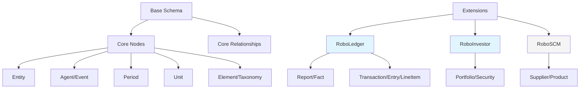

# RoboSystems Schema Extensions

## Overview

The RoboSystems schema system implements a **base + extensions** architecture for defining graph database structures in LadybugDB. Each extension defines a domain schema — the node types, relationships, and properties that model a specific business domain. This schema is the foundation that drives everything built on top of it: OLTP databases, API routes, data pipelines, and frontend applications.

**Key Concepts:**

- **Base Schema**: Core nodes shared by all graphs (Entity, Period, Unit, Element, Label, Reference, Taxonomy, Dimension, Structure, Association, Trait, Classification, Agent, Event)
- **Extensions**: Domain schemas that extend the base schema with domain-specific node types and relationships
- **Context-Aware Loading**: Different views of the same extension based on use case (e.g., SEC reporting vs full accounting)
- **Product Extensions**: Extensions like RoboLedger and RoboInvestor that grow beyond the graph schema into full product verticals with dedicated databases, API surfaces, data pipelines, and frontend applications

## Ontology Invariants

Two rules govern how the base schema and extensions are organized. These are load-bearing — future schema changes should be evaluated against them, and breaking them produces the kind of asymmetry that forces painful refactors against materialized data.

### Invariant 1 — Base is aspirational

**Base contains concepts that are universally applicable to the ontology, regardless of current consumer count.**

Period, Unit, Element, Taxonomy, Dimension, Association, Structure are declared in `base.py` even though only roboledger currently populates most of them. This is intentional: roboinvestor and future RoboX products (when their design and OLTP actually land) will grow into them, and retrofitting "promote this concept to base when a second consumer shows up" is a breaking schema change against already-materialized databases.

**Rule**: When deciding whether a new concept belongs in base or an extension, ask *"is it universally applicable to the ontology?"* — NOT *"do multiple extensions use it today?"*. Waiting for a second consumer turns every promotion into a migration.

### Invariant 2 — Aspects attach only to measured events

**Period, Unit, and Dimension are aspects that qualify measured observations. They never attach to declarative nodes.**

Measured events (Facts, LineItem dimensional tags, future Trades) carry aspect edges. Declarative nodes (Entity, Report, Taxonomy, Portfolio) do not. Any proposed edge of the form `(Entity | Report | Taxonomy | Portfolio)_HAS_(Period | Unit | Dimension)` is a category error — rewrite as a node property or as a query over the underlying events.

The same conceptual type (currency, time) can legitimately appear as both a static attribute on a declarative node AND as an aspect edge on a measured event. These are distinct roles — *declaration* vs *observation* — and both are legitimate. For example, an Entity may have a static `reporting_currency` property (declaration), while a Fact has a `FACT_HAS_UNIT` edge to a Unit node (observation).

### Before proposing a new edge or node

1. Does it satisfy Invariant 1? If you can't justify the shelving under "universally applicable," it probably belongs in a domain extension, not base.
2. Does it satisfy Invariant 2? If your new edge hangs an aspect off a declarative node, stop and rewrite as a node property or reroute through the underlying measured events.
3. Does it exist as a latent concept already? The schema may already model what you need through existing edges — check before adding.

## How Extensions Work

Each extension defines the domain model for its application — the node types, relationships, and properties that the application understands. The extension schema is the single source of truth that drives:

1. **Graph Database Structure**: Node tables and relationship tables in LadybugDB
2. **OLTP Database Schema**: PostgreSQL tables that mirror the schema for transactional workloads
3. **API Surface**: Endpoints that expose and operate on the domain model
4. **Data Pipelines**: ETL/ELT jobs that transform external data into the schema
5. **AI Operator Context**: MCP tools use the schema to understand what queries are valid
6. **Frontend Applications**: UI components are built around the domain model

Not every extension has all of these layers today. Some are schema-only (graph schema). Others — RoboLedger and RoboInvestor — have grown into full product extensions with dedicated infrastructure.

### Product Extensions vs Schema Extensions

| Layer | Schema Extension | Product Extension |
|-------|-----------------|-------------------|
| Graph schema | Yes | Yes |
| OLTP database | No | Yes (schema-per-tenant PostgreSQL) |
| API routes | No | Yes (feature-flagged, base name) |
| Data pipelines | No | Yes (Dagster assets, dbt models) |
| Frontend app | No | Yes (dedicated app, own domain) |
| Trademark / brand | No | Yes |

**Current product extensions:**

| Extension | Product | App | Domain |
|-----------|---------|-----|--------|
| `roboledger` | RoboLedger | [roboledger.ai](https://roboledger.ai) | Accounting, financial reporting, general ledger |
| `roboinvestor` | RoboInvestor | [roboinvestor.ai](https://roboinvestor.ai) | Portfolio management, investment tracking |

**Non-product extensions:**

| Extension | Domain |
|-----------|--------|
| `memory` | AI memory (concepts, observations, sessions) |

Other RoboX products (RoboFO, RoboSCM, RoboHRM, RoboEPM, RoboWorkflow, …) are planned but unbuilt — their schemas land alongside OLTP + adapters when the product is designed and prioritized, not as speculative placeholders.

### URL Shape and Feature Flags

Product extensions are served under a unified `/extensions/*` surface split between a single GraphQL read endpoint and named command operations for writes. The domain name (`roboledger`, `roboinvestor`) appears in the write URL and in the feature-flag name; read queries are namespaced through the Strawberry schema instead of the URL.

```
# Reads (GraphQL) — schema composed dynamically from enabled domains
POST /extensions/{graph_id}/graphql          Query { entity { … } fiscalCalendar { … } portfolios { … } }

# Writes (named command operations)
POST /extensions/roboledger/{graph_id}/operations/{op}     → ROBOLEDGER_ENABLED
POST /extensions/roboinvestor/{graph_id}/operations/{op}   → ROBOINVESTOR_ENABLED

# Analytical view operations (graph-backed, read-only, gated independently)
POST /extensions/{domain}/{graph_id}/operations/{view_name}     → per-view flag (e.g. FACT_GRID_ENABLED)
```

**Feature flags:**

| Flag | Effect |
| --- | --- |
| `ROBOLEDGER_ENABLED` | Mounts roboledger operations router, adds `LedgerQuery` to GraphQL schema |
| `ROBOINVESTOR_ENABLED` | Mounts roboinvestor operations router, adds `InvestorQuery` to GraphQL schema |
| `EXTENSIONS_GRAPHQL_ENABLED` | Kill switch for `/extensions/{graph_id}/graphql` (default `true`) |
| `FACT_GRID_ENABLED` | Gates the graph-backed fact-grid view, independent of roboledger — lets SEC-only deployments use it |
| `EXTENSIONS_ENABLED` | **Derived** (`ROBOLEDGER_ENABLED or ROBOINVESTOR_ENABLED`); controls extensions DB engine |

A ledger-only deployment's GraphQL schema exposes only ledger fields — investor types never appear in introspection. The schema is built at class-construction time from whichever domain mixins are enabled, so there are no runtime `*_NOT_INITIALIZED` errors from disabled domains.

Legacy env-var names (`LEDGER_ENABLED`, `INVESTOR_ENABLED`, standalone `EXTENSIONS_ENABLED`) have been retired — only the `ROBO*_ENABLED` names are read.

## Architecture

### Declaration vs runtime split

The schemas module is organized into two layers:

- **Declaration layer** (`schemas/` top level): pure ontology source of truth. Side-effect free, no database access. `base.py`, `models.py`, `loader.py`, and `extensions/` declare what the ontology IS.
- **Runtime layer** (`schemas/runtime/`): runtime behavior that consumes the declarations. Builders, validators, parsers, and managers that do work: compile schemas, validate operations, parse Cypher DDL, handle user-supplied custom schemas.

```
robosystems/schemas/
├── __init__.py
├── README.md                # This file
│
├── # ── Declaration layer (ontology source of truth) ──────────────────
├── base.py                  # BASE_NODES + BASE_RELATIONSHIPS (Entity, Period, Unit,
│                            #   Element, Label, Reference, Taxonomy, Dimension,
│                            #   Structure, Association, Classification)
├── models.py                # Node/Property/Relationship dataclasses + to_cypher() DDL
├── loader.py                # Runtime schema composition + introspection API
│                            #   (list_node_types, get_node_schema, validate_node_properties)
├── extensions/              # Per-extension declarations
│   ├── roboledger.py        #   Financial reporting & accounting
│   ├── roboinvestor.py      #   Portfolio & investment management
│   └── memory.py            #   AI memory schema
│
└── # ── Runtime layer (builders, validators, parsers) ─────────────────
    └── runtime/
        ├── manager.py       # SchemaManager / SchemaConfiguration — build + compile
        ├── builder.py       # LadybugSchemaBuilder — full schema orchestration
        ├── custom.py        # CustomSchemaManager / Parser — user-supplied JSON/YAML
        ├── validator.py     # LadybugSchemaValidator — runtime validation
        └── parser.py        # Cypher DDL → metadata (reverse path)
```

Runtime schema **application** (CREATE NODE/REL TABLE against LadybugDB) lives in `graph_api/core/ladybug/manager.py`, not here — the schemas module is purely a declaration + compile layer, not an installer.

### Schema Hierarchy


```mermaid
graph TD
    A[Base Schema] --> B[Core Nodes]
    A --> C[Core Relationships]
    B --> D[Entity]
    B --> E[Agent/Event]
    B --> F[Period]
    B --> G[Unit]
    B --> H[Element/Taxonomy]

    I[Extensions] --> J[RoboLedger]
    I --> K[RoboInvestor]
    I --> L[RoboSCM]

    J --> M[Report/Fact]
    J --> N[Transaction/Entry/LineItem]
    K --> O[Portfolio/Security]
    L --> P[Supplier/Product]

    style J fill:#e1f5fe
    style K fill:#e1f5fe
    style L fill:#f5f5f5
```

## Base Schema

The base schema (`base.py`) provides foundational nodes and relationships that all applications share:

### Core Nodes

| Node              | Purpose                                | Key Properties                                 |
| ----------------- | -------------------------------------- | ---------------------------------------------- |
| **Entity**        | Organizations, companies, subsidiaries | identifier, cik, ticker, name, entity_type     |
| **Agent**         | REA counterparty (customer, vendor, …) | identifier, agent_type, name, source           |
| **Event**         | REA business event with canonical action verb | identifier, event_type, event_action, status   |
| **Period**        | Time periods for data                  | start_date, end_date, period_type              |
| **Unit**          | Measurement units                      | measure, value, numerator_uri                  |
| **Element**       | XBRL taxonomy elements                 | qname, period_type, is_numeric                 |
| **Label**         | Human-readable element labels          | value, type, language                          |
| **Reference**     | Authoritative element references       | value, type                                    |
| **Taxonomy**      | Global XBRL taxonomies                 | name, version, namespace                       |
| **Dimension**     | XBRL dimensional axis/member tags      | axis, member, dimension_type                   |
| **Structure**     | Named element collection (network)     | network_uri, definition, type                  |
| **Association**   | Element relationships (calc, present.) | arcrole, order_value, association_type         |
| **Trait**         | FASB us-gaap metamodel vocabulary (element axes/categories) | identifier, category, type, source |
| **Classification**| Structural pattern classification for associations | identifier, category, type, source |

`Agent` and `Event` are universal REA primitives — every planned RoboX extension needs them. `Event.event_action` carries the canonical 19-verb action vocabulary (`models/extensions/roboledger/event.py:EVENT_ACTIONS`) refining the coarser `event_category`. The vocabulary converges with Valueflows v1.0; canonical naming is RoboSystems-native. SEC-flavored repositories get the schema with empty tables (no rows loaded).

### Core Relationships

- **ENTITY_OWNS_ENTITY** → Entity: Hierarchical ownership
- **ELEMENT_HAS_LABEL** → Label: Human-readable descriptions
- **ELEMENT_IN_TAXONOMY** → Taxonomy: Taxonomy membership
- **ENTITY_HAS_AGENT / ENTITY_HAS_EVENT** → Agent/Event: Entity owns its REA records
- **EVENT_INVOLVES_AGENT** → Agent: Counterparty participating in an event
- **EVENT_AFFECTS_RESOURCE** → Element: REA stockflow — element playing the Resource role
- **EVENT_OBLIGATED_BY_EVENT** → Event: REA forward-materialization (commitment → fulfillment)
- **EVENT_DISCHARGES_EVENT** → Event: REA settlement / reciprocity
- **EVENT_REPLACES_EVENT** → Event: Correction chain (this event supersedes another)

Fiscal calendar / fiscal period stays OLTP-only — operational state (rolling close pointers, status mutations) rather than curated graph content. Operators query period membership via `Entry.posting_date` ranges; named-period lookup deferred until a concrete operator query demands it.

## Extension Schemas

### RoboLedger — Financial Reporting & Accounting

The RoboLedger extension models the full accounting domain: financial reporting (XBRL/SEC), general ledger (transactions, journal entries), and chart of accounts (via Element/Association patterns). It uses context-aware loading to present different views depending on the use case.

**Full product extension** with OLTP tables in the `extensions` database (schema-per-tenant), a GraphQL read surface under `/extensions/{graph_id}/graphql` (38 fields), named command operations under `/extensions/roboledger/{graph_id}/operations/*` (~20+ commands), graph-backed analytical view operations over the materialized data, a QuickBooks ELT pipeline, and a dedicated frontend app.

#### Reporting Section (SEC/XBRL)

- **Nodes**: Report, Fact, Structure, Association, FactSet
- **Use Cases**: SEC repositories, financial statements, XBRL processing
- **Key Features**: Dimensional analysis, fact aggregation, taxonomy navigation

#### Transaction Section (General Ledger)

- **Nodes**: Transaction, Entry, LineItem
- **Use Cases**: Entity accounting, journal entries, trial balances
- **Key Features**: Three-level model (Transaction → Entry → LineItem), dimensional tagging (department, class, location)
- **Note**: Chart of accounts is represented via Element/Association pattern (shared with Reporting Section)
- **McCarthy bridge edge**: `EVENT_TRIGGERS_TRANSACTION` (Event → Transaction) realizes McCarthy 1982's REA vision at the graph layer — every GL Transaction is traceable to the originating Event when one exists. Materialized from `transactions.triggered_by_event_id`; manual-only Transactions have no edge.

#### Context-Aware Loading

```python
# SEC Repository — reporting only (hides transaction tables from AI Operators)
loader = get_contextual_schema_loader("repository", "sec")

# Entity Database — full accounting
loader = get_contextual_schema_loader("application", "roboledger")
```

### RoboInvestor — Portfolio Management

The RoboInvestor extension models portfolio management, securities, and position tracking. It is a **full product extension** — secondary to RoboLedger but with the same layers: OLTP models in the `extensions` database (schema-per-tenant), an operations kernel (`operations/roboinvestor/{reads,commands}/`), a command operations router under `/extensions/roboinvestor/{graph_id}/operations/*`, 7 GraphQL fields (`InvestorQuery`), and a dedicated frontend app.

- **Nodes**: Portfolio, Security, Position
- **Relationships**: Portfolio positions, security pricing, optional Security → Entity link
- **Key Features**:
  - Multi-portfolio management
  - Lot-level position tracking
  - Cross-graph report sharing (investor access to ledger reports)

> **Aspirational:** Trade, Benchmark, MarketData, Dividend, and Risk nodes are planned but not yet in the schema.

### RoboSCM — Supply Chain Management

- **Nodes**: Supplier, Product, Warehouse, Inventory, PurchaseOrder, Contract, Shipment, Demand
- **Supporting Nodes**: Contact, Address
- **Key Features**: Supplier management, inventory optimization, purchase order workflow, demand forecasting, logistics tracking

### RoboFO — Front Office & CRM

- **Nodes**: Lead, Customer, Contact, Opportunity, Campaign, Activity, Quote
- **Key Features**: Lead scoring and conversion, opportunity pipeline, campaign tracking, customer segmentation

### RoboEPM — Enterprise Performance Management

- **Nodes**: KPI, Budget, Forecast, Scorecard, Initiative
- **Key Features**: KPI dashboards, budget vs. actual analysis, rolling forecasts, strategic initiative management

### RoboHRM — Human Resources Management

- **Nodes**: Employee, Department, Position, Payroll, Benefit, TimeOff
- **Key Features**: Organizational hierarchy, compensation, benefits administration, time and attendance

### RoboReport — Regulatory Compliance

- **Nodes**: Regulation, Filing, Submission, Audit, Control
- **Key Features**: Regulatory requirement tracking, filing deadline management, compliance audit trails, control effectiveness

### Memory — AI Memory Schema

- **Nodes**: Concept, Observation, Session
- **Key Features**: AI knowledge graph for storing concepts and observations across AI Operator sessions

## Schema Management

### Loading Schemas

```python
from robosystems.schemas.loader import get_schema_loader

# Load all extensions (backward compatible)
loader = get_schema_loader()

# Load specific extensions
loader = get_schema_loader(extensions=["roboledger", "roboinvestor"])

# Context-aware loading for SEC repository
loader = get_contextual_schema_loader("repository", "sec")
```

### Building Schemas

```python
from robosystems.schemas.runtime.builder import LadybugSchemaBuilder

config = {
    "name": "My Financial Graph",
    "base_schema": "base",
    "extensions": ["roboledger", "roboinvestor"]
}

builder = LadybugSchemaBuilder(config)
builder.load_schemas()
cypher_ddl = builder.generate_cypher()
```

### Schema Validation

```python
from robosystems.schemas.runtime.validator import LadybugSchemaValidator

validator = LadybugSchemaValidator()

# Validate node properties
validator.validate_node("Entity", {
    "identifier": "entity123",
    "name": "Acme Corp",
    "cik": "0001234567"
})

# Validate relationships
validator.validate_relationship(
    "Entity", "Report", "ENTITY_HAS_REPORT",
    {"filing_context": "10-K"}
)
```

## Custom Schemas

The system supports user-defined schemas through JSON or YAML:

```json
{
  "name": "CustomAnalytics",
  "version": "1.0.0",
  "extends": "base",
  "nodes": [
    {
      "name": "Metric",
      "description": "Custom business metrics",
      "properties": [
        {
          "name": "id",
          "type": "STRING",
          "is_primary_key": true
        },
        {
          "name": "value",
          "type": "DOUBLE"
        }
      ]
    }
  ],
  "relationships": [
    {
      "name": "ENTITY_HAS_METRIC",
      "from_node": "Entity",
      "to_node": "Metric"
    }
  ]
}
```

### Loading Custom Schemas

```python
from robosystems.schemas.runtime.custom import CustomSchemaManager

manager = CustomSchemaManager()
schema = manager.create_from_json(json_string)
merged = manager.merge_with_base(schema)
```

## Data Types

### Supported LadybugDB Types

| Category     | Types                                    | Usage                    |
| ------------ | ---------------------------------------- | ------------------------ |
| **Strings**  | STRING                                   | Names, identifiers, text |
| **Numbers**  | INT8, INT16, INT32, INT64, DOUBLE, FLOAT | Quantities, amounts      |
| **Temporal** | DATE, TIMESTAMP, INTERVAL                | Time-based data          |
| **Boolean**  | BOOLEAN                                  | Flags, states            |
| **Special**  | UUID, BLOB                               | Unique IDs, binary data  |
| **Complex**  | LIST, MAP, STRUCT, UNION                 | Structured data          |

### Type Mappings

```python
# Property definition with types
Property(name="amount", type="DOUBLE")
Property(name="filing_date", type="DATE")
Property(name="is_active", type="BOOLEAN")
Property(name="identifier", type="STRING", is_primary_key=True)
```

## Schema Compatibility

The `SchemaManager` provides compatibility checking for extension combinations:

```python
from robosystems.schemas.runtime.manager import SchemaManager

manager = SchemaManager()

# Check compatibility
compatibility = manager.check_schema_compatibility([
    "roboledger", "roboinvestor"
])

if compatibility.compatible:
    print("Extensions are compatible")
else:
    print(f"Conflicts: {compatibility.conflicts}")
```

## Production Usage

### Multi-Tenant Deployment

```python
# Standard tier — single product extension
config_standard = {
    "extensions": ["roboledger"],
    "tier": "standard"
}

# Large tier — multiple product extensions with subgraph support
config_large = {
    "extensions": ["roboledger", "roboinvestor"],
    "tier": "large"
}
```

### SEC Repository Configuration

```python
# SEC public data repository
# Uses reporting-only view to prevent AI Operator confusion
loader = get_contextual_schema_loader("repository", "sec")

# This filters out transaction tables that don't exist in SEC data
# Ensures AI Operators only see relevant XBRL/reporting tables
```

### Entity Database Configuration

```python
# Full enterprise accounting system
loader = get_contextual_schema_loader("application", "roboledger")

# Multi-product deployment
config = {
    "name": "XLarge Suite",
    "extensions": ["roboledger", "roboinvestor"]
}
```

## Schema Evolution

### Safe Schema Updates

The system uses `CREATE TABLE IF NOT EXISTS` to prevent data loss:

```python
# Schema changes require migration scripts
# Never use DROP/CREATE in production

# Safe addition of new nodes/relationships
CREATE NODE TABLE IF NOT EXISTS NewNode(...)

# For schema modifications, use LadybugDB ALTER commands
ALTER TABLE Entity ADD COLUMN new_field STRING
```

### Migration Strategy

1. **Additive Changes**: New nodes/relationships can be added safely
2. **Property Additions**: Use ALTER TABLE to add new properties
3. **Breaking Changes**: Require coordinated migration scripts
4. **Version Tracking**: Track schema/tier metadata on the platform `Graph` model (`models/core/graph/graph.py`), not on a graph node

## Best Practices

### 1. Extension Selection

- **Start Minimal**: Begin with base + the product extension you need
- **Add Incrementally**: Add extensions as features are needed
- **Consider Performance**: More extensions = larger schema overhead

### 2. Context-Aware Loading

- **SEC Repositories**: Always use reporting-only context
- **Entity Databases**: Use full context for complete functionality
- **API Endpoints**: Match schema loading to endpoint requirements

### 3. Custom Schemas

- **Extend, Don't Replace**: Build on base schema for compatibility
- **Avoid Reserved Names**: Check RESERVED_NODE_NAMES in custom.py
- **Validate Early**: Test custom schemas in development first

### 4. Performance Optimization

- **Index Primary Keys**: All primary keys are automatically indexed
- **Minimize Properties**: Only include necessary properties
- **Batch Operations**: Use bulk loading for initial data

### 5. Security Considerations

- **Access Control**: A platform-DB concern — graph access is enforced through the platform models (`models/core/user/`, e.g. `GraphUser`), not via a graph relationship. The base schema has no user/access node.
- **Data Isolation**: Multi-tenant separation at database level
- **Audit Trails**: Track all schema modifications

## Troubleshooting

### Common Issues

| Issue                            | Cause                   | Solution                           |
| -------------------------------- | ----------------------- | ---------------------------------- |
| **Duplicate node names**         | Extension conflicts     | Check compatibility before loading |
| **Missing primary key**          | Schema definition error | Ensure all nodes have identifier   |
| **Relationship reference error** | Node doesn't exist      | Load required extensions           |
| **Context loading fails**        | Unsupported context     | Use predefined contexts only       |

### Debugging

```python
# Enable debug logging
import logging
logging.basicConfig(level=logging.DEBUG)

# Inspect loaded schema
loader = get_schema_loader(extensions=["roboledger"])
print(f"Loaded nodes: {loader.list_node_types()}")
print(f"Loaded relationships: {loader.list_relationship_types()}")

# Validate schema consistency
from robosystems.schemas.runtime.manager import SchemaManager
manager = SchemaManager()
manager._validate_schema_consistency(schema)
```

## API Integration

The schema system integrates with the RoboSystems API:

### Graph Operations

- Schema installation during database creation
- Validation before data ingestion
- Query generation based on schema

### MCP Integration

- Context-aware schema exposure to AI Operators
- Natural language to Cypher query generation
- Schema-guided response formatting
